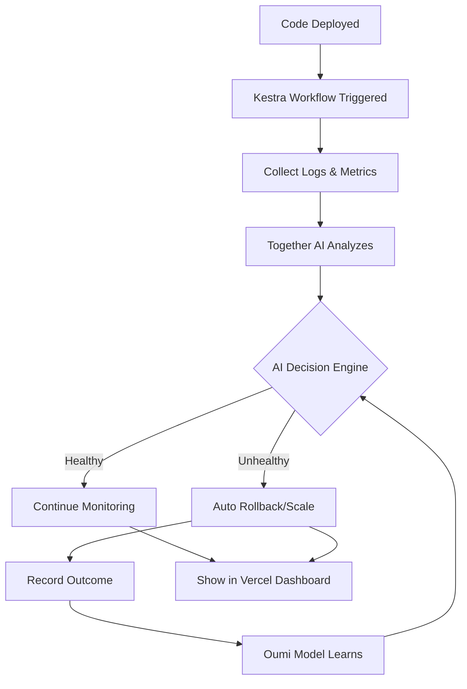

# AI DevOps Commander

> *An experimental AI-driven DevOps automation prototype that observes deployments, summarizes system signals, and automates response workflows.*

## ▶️ Watch the Demo & Project Walkthrough

If you want to understand this project quickly, start here:

- 🎬 **YouTube Demo**: https://www.youtube.com/ (replace with actual link)
- 💼 **LinkedIn Post**: https://www.linkedin.com/posts/rishi-jat_finally-recorded-the-demo-this-isai-activity
- 🐦 **X (Twitter) Post**: https://x.com/rishixtwt/status/2000539194574479696
- 📦 **GitHub Repository**: https://github.com/rishi-jat/ai-devops-commander

The demo shows how **Kestra orchestrates the workflow end to end**, how AI summarizes deployment signals, how decisions are made, and how everything is surfaced in the dashboard.

[](https://github.com/cline/cline)
[](https://kestra.io)
[](https://together.ai)
[](https://vercel.com)
[](https://oumi.ai)
[](https://coderabbit.ai)

---
This README explains:
- the real-world problem this project addresses
- the system architecture
- how the automation works end to end
- how to run the prototype locally

## About this project

I built this prototype to explore how AI could help automate some of the repetitive and manual tasks in DevOps, especially around incident response after deployments. The idea came from seeing how often engineers have to dig through logs and metrics manually to figure out what went wrong, which slows down fixing issues and increases downtime. This project tries to automate observing system signals, summarizing them, and making simple decisions like rolling back or scaling automatically. It’s an early prototype using mocked data to demonstrate the concept.

---

## The problem

DevOps workflows often rely on manual steps and reacting after problems occur. Typically, after code is deployed:

- Logs and metrics start coming in
- Alerts might fire
- Engineers have to investigate logs and metrics manually
- It’s easy to lose context or make rushed decisions
- Systems can stay degraded longer than necessary

This slows down recovery and iteration.

### What usually happens

1. Code is merged
2. Tests pass
3. Deployment succeeds
4. Then nothing for a while
5. After some time, error rates spike
6. Someone manually checks logs
7. They try to guess the root cause
8. Rollback or patch is applied
9. Same process repeats next time

This pattern is common in many teams shipping daily.

---

## The solution

This prototype tries to automate the post-deployment observation and response process by:

1. Deploying code through standard pipelines
2. Collecting logs, metrics, and traces automatically
3. Using an AI agent (Kestra) to summarize system health
4. Applying a reinforcement learning model (Oumi) to decide on actions
5. Executing automatic responses like rollback or scaling
6. Recording outcomes to improve decision policies over time

### How it works in practice

1. Code is merged and deployed
2. AI immediately starts observing system signals
3. Logs and metrics are summarized within about 30 seconds
4. The system detects issues like increased error rates or memory leaks
5. If needed, an automatic rollback is triggered
6. The outcome is recorded and used to improve future decisions

This shows how summarization and decision-making can reduce manual investigation time in a controlled setting.

---

## Architecture

This section describes the main components of the system and how data flows between them during a deployment event.

### Components

```
AI DevOps Commander

1. Code creation          → Cline (autonomous code fixes)
2. Code review            → CodeRabbit (PR hygiene)
3. Orchestration + Brain  → Kestra (workflows + AI decisions)
4. AI Inference           → Together AI (LLM for decision making)
5. Learning               → Oumi (reinforcement learning policy)
6. Visibility             → Vercel (dashboard UI)
```

### Workflow overview

At a high level, the system reacts to a deployment event, gathers runtime signals, summarizes them using an AI agent, makes a decision, and then executes an action automatically.



All data used here is simulated to keep the demo deterministic.

---

## Key features explained

### Autonomous observation loop (Kestra)

- Listens for deployment events
- Gathers logs from different sources automatically
- Orchestrates the entire AI decision pipeline
- Avoids manual log inspection

### AI Decision Making (Together AI)

- Analyzes deployment metrics using LLM inference
- Provides CONTINUE or ROLLBACK decisions with confidence scores
- Explains reasoning behind each decision
- Processes error rates, memory usage, CPU, and response times

### Reinforcement Learning (Oumi RL)

- Collects training data from each deployment decision
- Uses outcomes to improve future decisions
- Aims to reduce downtime and error rates over time

### Automated remediation suggestions (Cline)

- Generates code fixes and scaffolds pull requests for review

### Code quality (CodeRabbit)

- Ensures all changes are reviewed by AI
- Enforces documentation and code quality standards
- Keeps pull request history clean

### Dashboard (Vercel)

- Shows real-time deployment status and AI reasoning
- Displays decision history and audit trail of actions

---

## Demo walkthrough (conceptual)

1. Deploy code → service goes live
2. Logs start streaming → Kestra collects data
3. AI summarizes → e.g., "Memory leak detected, error rate 35%"
4. Model decides → e.g., "Rollback recommended (87% confidence)"
5. Action executes → previous version restored automatically
6. Dashboard updates → timeline, reasoning, outcome shown
7. System learns → improves response for next similar incident

This demo illustrates an end-to-end incident response workflow with automated observation and action.

---

## Tech stack

| Component       | Tool        | Purpose                              |
|-----------------|-------------|--------------------------------------|
| Orchestration   | Kestra      | Workflow engine and orchestration    |
| AI Inference    | Together AI | LLM for intelligent decision making  |
| Code automation | Cline       | Autonomous code generation           |
| Code quality    | CodeRabbit  | PR reviews and code hygiene          |
| Learning        | Oumi        | Reinforcement learning training      |
| Frontend        | Vercel      | Dashboard hosting and UI             |

---

## Project structure

```
ai-devops-commander/
├── README.md                           # This file
├── VIDEO_SCRIPT.md                     # Hackathon video script
├── LICENSE                             # MIT License
├── setup.sh                            # One-command setup script
├── kestra/
│   ├── docker-compose.yml              # Kestra + PostgreSQL
│   ├── README.md                       # Kestra-specific docs
│   └── workflows/
│       ├── ai-devops-workflow.yml      # Main AI workflow (demo)
│       └── devops-loop.yml             # Extended workflow
├── dashboard/
│   ├── app/
│   │   ├── api/
│   │   │   ├── deployments/route.ts    # Fetch from Kestra API
│   │   │   └── trigger/route.ts        # Webhook trigger
│   │   ├── page.tsx                    # Main dashboard page
│   │   └── layout.tsx                  # App layout
│   ├── components/
│   │   └── DeploymentDashboard.tsx     # Real-time UI component
│   ├── package.json                    # Next.js 14, React 18
│   └── vercel.json                     # Vercel deployment config
├── cline-automation/
│   ├── trigger-cline.sh                # Main automation entry
│   ├── auto-fix-performance.sh         # Performance fixes
│   └── auto-fix-generic.sh             # Fallback remediation
├── cline-scripts/
│   ├── auto-fix-memory-leak.sh         # Memory leak fixes
│   └── auto-fix-database-timeout.sh    # DB optimization
├── oumi/
│   ├── train_deployment_policy.ipynb   # RL training notebook
│   └── README.md                       # Oumi setup docs
└── mock-data/
    ├── logs.json                       # Sample log data
    ├── metrics.json                    # Sample metrics
    └── deployments.json                # Sample history
```

---

## Getting started

This is a prototype using mocked data and is intended for demonstration only.

### Prerequisites

- Docker (for running Kestra + PostgreSQL)
- Node.js 18+ (for the Next.js dashboard)
- Git (to clone the repo)

That's it. No Python installation needed (runs in Kestra container).

### Quick start

```bash
# Clone repo
git clone https://github.com/rishi-jat/ai-devops-commander
cd ai-devops-commander

# Use the setup script (easiest way)
./setup.sh

# Or manual setup:

# 1. Start Kestra
cd kestra
docker-compose up -d

# 2. Create workflow in Kestra UI
# - Open http://localhost:8080
# - Go to Flows → Create Flow
# - Copy content from kestra/workflows/devops-loop.yml
# - Save it

# 3. Start dashboard
cd ../dashboard
npm install
npm run dev

# 4. Open browser
open http://localhost:3000
open http://localhost:8080
```

---

## Demo video

🎬 **Watch the demo**: [Coming Soon]

The video demonstrates:
- Kestra workflow execution
- Together AI analyzing deployment metrics
- AI making CONTINUE/ROLLBACK decisions
- Real-time dashboard visualization

---

## Contributing

This project is open source and follows basic practices like code review via CodeRabbit and documentation. Contributions are welcome!

Feel free to open issues or submit pull requests.

---

## License

MIT License - see [LICENSE](LICENSE)

---

## Acknowledgments

This project uses:

- [Kestra](https://kestra.io) for workflow orchestration  
- [Together AI](https://together.ai) for LLM inference  
- [Oumi](https://oumi.ai) for reinforcement learning  
- [Cline](https://github.com/cline/cline) for autonomous coding  
- [CodeRabbit](https://coderabbit.ai) for AI code review  
- [Vercel](https://vercel.com) for dashboard hosting  

---

## Connect

- Twitter/X: https://twitter.com/rishixtwt  
- GitHub: https://github.com/rishi-jat  
- LinkedIn: https://linkedin.com/in/rishi-jat-496245320  

---

*Made with ❤️ by Rishi.*
