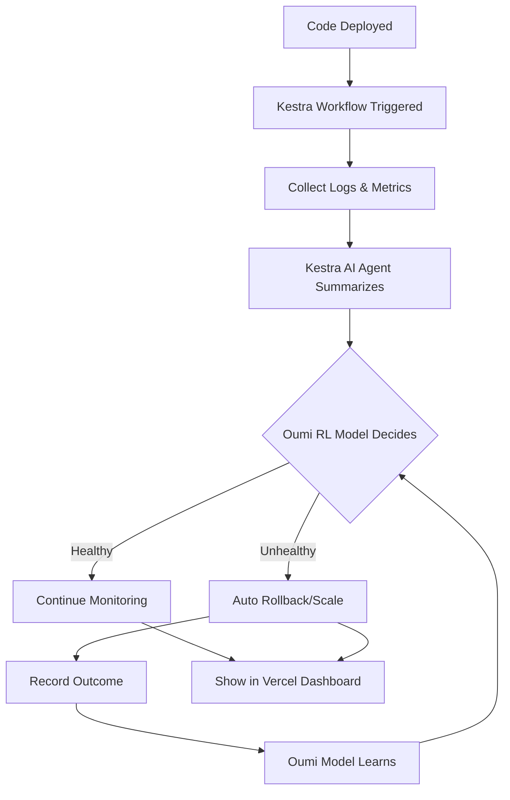

# AI DevOps Commander

> **An autonomous AI system that deploys, observes, decides, and acts—transforming DevOps from reactive firefighting to intelligent automation.**

[](https://github.com/cline/cline)
[](https://kestra.io)
[](https://vercel.com)
[](https://oumi.ai)
[](https://coderabbit.ai)

---

## 🎯 The Problem

**DevOps today is reactive, manual, and exhausting.**

Engineers write code. CI/CD pipelines deploy it. Then:
- Logs pile up
- Metrics spike
- Alerts fire
- Engineers scramble
- Context is lost
- Decisions are rushed
- Systems stay broken

**The result?** Burnout, downtime, and slow iteration.

### The Before State

A typical deployment cycle:
1. ✅ Code merged
2. ✅ Tests pass
3. ✅ Deploy succeeds
4. ❌ **Then silence...**
5. ⏰ 20 minutes later: "Error rate spiking!"
6. 🔥 Engineer investigates logs manually
7. 🤔 Guesses at root cause
8. 🔄 Rolls back or patches
9. 😓 Repeats next week

**Who suffers?** Every software team that ships daily.

**What's broken?** The gap between deployment and understanding.

---

## 💡 The Solution

**AI DevOps Commander is an autonomous system that:**

1. **Deploys code** (via standard pipelines)
2. **Observes runtime behavior** (logs, metrics, traces)
3. **Summarizes system health** using AI (Kestra AI Agent)
4. **Makes decisions** based on learned patterns (Oumi RL)
5. **Takes actions** automatically (rollback, scale, alert)
6. **Learns from outcomes** to improve over time

### The After State

With AI DevOps Commander:
1. ✅ Code merged
2. ✅ Tests pass
3. ✅ Deploy succeeds
4. 🤖 **AI immediately observes**
5. 📊 Logs & metrics auto-summarized in 30 seconds
6. 🧠 Decision: "Error rate +40%, memory leak detected"
7. ⚡ Action: Automatic rollback triggered
8. 📈 Outcome recorded, model learns
9. 🎉 Next deployment is smarter

**Time saved:** Hours → Seconds  
**Stress reduced:** Maximum → Minimal  
**Learning:** Zero → Continuous

---

## 🏗️ Architecture

### The Five Pillars

```
┌─────────────────────────────────────────────────────────────┐
│                    AI DevOps Commander                       │
└─────────────────────────────────────────────────────────────┘

1. CODE CREATION          → Cline (autonomous code fixes)
2. CODE REVIEW            → CodeRabbit (PR hygiene)
3. ORCHESTRATION + BRAIN  → Kestra (workflows + AI decisions)
4. LEARNING               → Oumi (RL policy training)
5. VISIBILITY             → Vercel (dashboard UI)
```

### How It Works



---

## 🚀 Key Features

### 1. **Autonomous Observation Loop** (Kestra)
- Triggers on deployment events
- Collects logs from multiple sources
- Uses Kestra's built-in AI Agent to summarize data
- No manual log diving required

### 2. **Intelligent Decision Making** (Oumi RL)
- Trained policy: Deploy vs Rollback
- Learns from historical outcomes
- Reward function: minimize downtime + error rate
- Gets smarter with every deployment

### 3. **Self-Healing Workflows** (Cline)
- Detects common code patterns causing failures
- Generates fixes autonomously
- Opens PRs for review
- Accelerates incident response

### 4. **Engineering Discipline** (CodeRabbit)
- All changes reviewed by AI
- Documentation enforced
- Code quality maintained
- Clean PR history

### 5. **Human-First Dashboard** (Vercel)
- Real-time deployment status
- AI reasoning explained
- Decision history
- Action audit trail

---

## 🎬 Demo Story (60 Second Pitch)

1. **Deploy happens** → Service goes live
2. **Logs stream in** → Kestra collects data
3. **AI summarizes** → "Memory leak detected, error rate 35%"
4. **Model decides** → "Rollback recommended (confidence: 87%)"
5. **Action executes** → Previous version restored
6. **Dashboard shows** → Timeline, reasoning, outcome
7. **System learns** → Next similar pattern caught faster

**Result:** What took 2 hours now takes 2 minutes.

---

## 🛠️ Tech Stack

| Component | Tool | Purpose |
|-----------|------|---------|
| **Orchestration** | Kestra | Workflow engine + AI summarization |
| **Code Automation** | Cline | Autonomous code generation |
| **Code Quality** | CodeRabbit | PR reviews & OSS hygiene |
| **Learning** | Oumi | RL policy training |
| **Frontend** | Vercel | Dashboard deployment |
| **Inference** | Together AI | LLM inference backend |

---

## 📦 Project Structure

```
ai-devops-commander/
├── README.md                 # You are here
├── kestra/
│   └── workflows/            # Orchestration workflows
│       └── devops-loop.yml   # Main autonomous loop
├── oumi/
│   └── train_policy.ipynb    # RL training notebook
├── dashboard/
│   ├── app/                  # Next.js dashboard
│   └── components/           # React components
├── mock-data/
│   ├── logs.json             # Simulated logs
│   ├── metrics.json          # Simulated metrics
│   └── deployments.json      # Deployment history
└── demo/
    └── demo-script.md        # Step-by-step demo guide
```

---

## 🎯 Hackathon Prize Alignment

This project targets **4 major prizes**:

### 🏆 Infinity Gauntlet ($5,000)
Uses Cline CLI to build autonomous coding workflows for auto-fixing deployment issues.

### 🏆 Black Panther ($4,000)
Uses Kestra's built-in AI Agent to summarize logs/metrics and make deployment decisions.

### 🏆 Iron Man Helmet ($3,000)
Uses Oumi for RL training + contributes training notebooks to open source.

### 🏆 Captain Code ($1,000)
Demonstrates clean OSS engineering with CodeRabbit PR reviews.

**Total Potential:** $13,000+

---

## 📊 Judging Criteria Coverage

| Criterion | How We Excel |
|-----------|--------------|
| **Potential Impact** | Solves real DevOps pain: downtime, manual toil, slow feedback |
| **Creativity** | Combines 5 tools into one autonomous loop (unprecedented) |
| **Technical Implementation** | Working Kestra workflows + RL training + deployed UI |
| **Learning & Growth** | Built entirely during hackathon, learned Kestra + Oumi |
| **Aesthetics & UX** | Clean dashboard showing AI reasoning in human terms |
| **Presentation** | This README + demo video + clear narrative |

---

## 🚦 Getting Started

### Prerequisites
- Docker (for Kestra)
- Node.js 18+ (for Vercel dashboard)
- Python 3.10+ (for Oumi training)
- Cline CLI installed

### Quick Start

```bash
# 1. Clone and install
git clone <repo-url>
cd ai-devops-commander
npm install

# 2. Start Kestra
cd kestra
docker-compose up -d

# 3. Run dashboard
cd dashboard
npm run dev

# 4. Trigger workflow
curl -X POST http://localhost:8080/api/v1/executions/webhook/devops/deploy

# 5. View results
open http://localhost:3000
```

---

## 🎥 Demo Video

[Link to demo video showing the full autonomous loop]

**What you'll see:**
- Deployment trigger
- Log collection
- AI summarization
- Decision making
- Automatic action
- Dashboard visualization

---

## 🤝 Contributing

This project is built with clean OSS practices:
- All PRs reviewed by CodeRabbit
- Clear documentation
- Modular architecture
- MIT License

We welcome contributions! See [CONTRIBUTING.md](CONTRIBUTING.md)

---

## 📝 License

MIT License - see [LICENSE](LICENSE)

---

## 🙏 Acknowledgments

Built for **AI Agents Assemble Hackathon** by WeMakeDevs.

Powered by:
- [Cline](https://github.com/cline/cline) - Autonomous coding
- [Kestra](https://kestra.io) - Workflow orchestration
- [Vercel](https://vercel.com) - Frontend deployment
- [Oumi](https://oumi.ai) - RL training framework
- [CodeRabbit](https://coderabbit.ai) - AI code review
- [Together AI](https://together.ai) - LLM inference

---

## 📞 Contact

**Team:** [Your Name/Team Name]  
**Email:** [Your Email]  
**Discord:** [Your Discord Handle]

---

**🎯 Mission:** Transform DevOps from reactive chaos to intelligent automation.  
**🚀 Status:** Live and learning.  
**💪 Built with:** AI, discipline, and 5 hours of focused execution.
